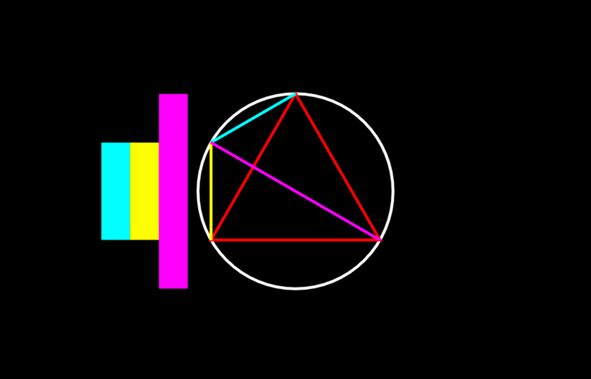

# Ptolemy's Theorem — Equilateral Triangle Corollary

An interactive version of the equilateral triangle corollary derived from Ptolemy's theorem.

## Screenshot

## Usage

[Click here](http://13bob.net/ptolemy).
