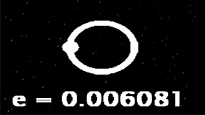

### Slingshoot
A 3D physics-based space game written in C++/OpenGL.

## Elements
**Orbital eccentricity indicator:**  
  

  
**Score:**  
  

  
**Aim angle (x|y):**  
  

## Libraries
- GLM
- GLFW
- GLEW
- irrKlang
  
Click [here](http://13bob.net/slingshoot/slingshoot.zip) to try.
